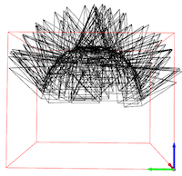
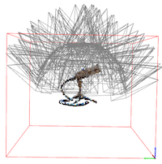

# DirectVoxGO

DirectVoxGO (Direct Voxel Grid Optimization, CVPR2022, see [our paper](https://arxiv.org/abs/2111.11215)) reconstructs a scene representation from a set of calibrated images capturing the scene. **The current version have improved speed by 1.8\~3.5x and supported forward-facing scenes comparing to the initial publication.**
- **NeRF-comparable quality** for synthesizing novel views of inward-bounded scene.
- **Super-fast convergence**: Our **`5 mins/scene`** vs. NeRF's `10~20+ hrs/scene`.
- **No cross-scene pre-training required**: We optimize each scene from scratch.
- **Better rendering speed**: Our **`0.36~0.07 secs`** vs. NeRF's `29 secs` to synthesize a `800x800` images.
- The newly implemented cuda extension is built just-in-time by pytorch at the first time you run the code.

Below run-times (*mm:ss*) of our optimization progress are measured on a machine with a single RTX 2080 Ti GPU.

https://user-images.githubusercontent.com/2712505/153380311-19d6c3a1-9130-489a-af16-ad36c78f10a9.mp4

https://user-images.githubusercontent.com/2712505/153380197-991d1689-6418-499c-a192-d757f9a64b64.mp4

### Update
See the [report](IMPROVING_LOG.md) for detail of below update:
- `2022.03.28`: **Reporting our large model on forward-facining scenes**.
- `2022.02.10`: **Extending for forward-facining scenes**.
- `2022.01.23`: **Improving training speed by 1.8\~3.5x**. Some intermediate steps are re-implemented in cuda but not fully fused---flexible but sacrficing speed. *Telsa V100*, *RTX 2080 Ti*, and *RTX 1080 Ti* are tested.
- `2021.11.23`: **Support CO3D dataset.**
- `2021.11.23`: **Initial release.**

### Next todo
- Sparse voxel structure.
- Extend to inward-unbounded scenes.

### Installation
```
git clone git@github.com:sunset1995/DirectVoxGO.git
cd DirectVoxGO
pip install -r requirements.txt
```
Pytorch installation is machine dependent, please install the correct version for your machine. The tested version is pytorch 1.8.1 with python 3.7.4.

<details>
  <summary> Dependencies (click to expand) </summary>

  - `PyTorch`, `numpy`: main computation.
  - `scipy`, `lpips`: SSIM and LPIPS evaluation.
  - `tqdm`: progress bar.
  - `mmcv`: config system.
  - `opencv-python`: image processing.
  - `imageio`, `imageio-ffmpeg`: images and videos I/O.
</details>


## Download: datasets, trained models, and rendered test views

<details>
  <summary> Directory structure for the datasets (click to expand; only list used files) </summary>

    data
    ├── nerf_synthetic     # Link: https://drive.google.com/drive/folders/128yBriW1IG_3NJ5Rp7APSTZsJqdJdfc1
    │   └── [chair|drums|ficus|hotdog|lego|materials|mic|ship]
    │       ├── [train|val|test]
    │       │   └── r_*.png
    │       └── transforms_[train|val|test].json
    │
    ├── Synthetic_NSVF     # Link: https://dl.fbaipublicfiles.com/nsvf/dataset/Synthetic_NSVF.zip
    │   └── [Bike|Lifestyle|Palace|Robot|Spaceship|Steamtrain|Toad|Wineholder]
    │       ├── intrinsics.txt
    │       ├── rgb
    │       │   └── [0_train|1_val|2_test]_*.png
    │       └── pose
    │           └── [0_train|1_val|2_test]_*.txt
    │
    ├── BlendedMVS         # Link: https://dl.fbaipublicfiles.com/nsvf/dataset/BlendedMVS.zip
    │   └── [Character|Fountain|Jade|Statues]
    │       ├── intrinsics.txt
    │       ├── rgb
    │       │   └── [0|1|2]_*.png
    │       └── pose
    │           └── [0|1|2]_*.txt
    │
    ├── TanksAndTemple     # Link: https://dl.fbaipublicfiles.com/nsvf/dataset/TanksAndTemple.zip
    │   └── [Barn|Caterpillar|Family|Ignatius|Truck]
    │       ├── intrinsics.txt
    │       ├── rgb
    │       │   └── [0|1|2]_*.png
    │       └── pose
    │           └── [0|1|2]_*.txt
    │
    ├── deepvoxels         # Link: https://drive.google.com/drive/folders/1ScsRlnzy9Bd_n-xw83SP-0t548v63mPH
    │   └── [train|validation|test]
    │       └── [armchair|cube|greek|vase]
    │           ├── intrinsics.txt
    │           ├── rgb/*.png
    │           └── pose/*.txt
    │
    ├── nerf_llff_data     # Link: https://drive.google.com/drive/folders/128yBriW1IG_3NJ5Rp7APSTZsJqdJdfc1
    │   └── [fern|flower|fortress|horns|leaves|orchids|room|trex]
    │
    └── co3d               # Link: https://github.com/facebookresearch/co3d
        └── [donut|teddybear|umbrella|...]
            ├── frame_annotations.jgz
            ├── set_lists.json
            └── [129_14950_29917|189_20376_35616|...]
                ├── images
                │   └── frame*.jpg
                └── masks
                    └── frame*.png
</details>

### Synthetic-NeRF, Synthetic-NSVF, BlendedMVS, Tanks&Temples, DeepVoxels datasets
We use the datasets organized by [NeRF](https://github.com/bmild/nerf), [NSVF](https://github.com/facebookresearch/NSVF), and [DeepVoxels](https://github.com/vsitzmann/deepvoxels). Download links:
- [Synthetic-NeRF dataset](https://drive.google.com/drive/folders/128yBriW1IG_3NJ5Rp7APSTZsJqdJdfc1) (manually extract the `nerf_synthetic.zip` to `data/`)
- [Synthetic-NSVF dataset](https://dl.fbaipublicfiles.com/nsvf/dataset/Synthetic_NSVF.zip) (manually extract the `Synthetic_NSVF.zip` to `data/`)
- [BlendedMVS dataset](https://dl.fbaipublicfiles.com/nsvf/dataset/BlendedMVS.zip) (manually extract the `BlendedMVS.zip` to `data/`)
- [Tanks&Temples dataset](https://dl.fbaipublicfiles.com/nsvf/dataset/TanksAndTemple.zip) (manually extract the `TanksAndTemple.zip` to `data/`)
- [DeepVoxels dataset](https://drive.google.com/open?id=1ScsRlnzy9Bd_n-xw83SP-0t548v63mPH) (manually extract the `synthetic_scenes.zip` to `data/deepvoxels/`)

Download all our trained models and rendered test views at [this link to our logs](https://drive.google.com/drive/folders/1Zn2adjQh82TivpxG-65UMCCVBmxRYDXe?usp=sharing).

### LLFF dataset
We use the LLFF dataset organized by NeRF. Download link: [nerf_llff_data](https://drive.google.com/drive/folders/128yBriW1IG_3NJ5Rp7APSTZsJqdJdfc1).

### CO3D dataset
We also support the recent [Common Objects In 3D](https://github.com/facebookresearch/co3d) dataset.
Our method only performs per-scene reconstruction and no cross-scene generalization.


## GO

### Train
To train `lego` scene and evaluate testset `PSNR` at the end of training, run:
```bash
$ python run.py --config configs/nerf/lego.py --render_test
```
Use `--i_print` and `--i_weights` to change the log interval.

### Evaluation
To only evaluate the testset `PSNR`, `SSIM`, and `LPIPS` of the trained `lego` without re-training, run:
```bash
$ python run.py --config configs/nerf/lego.py --render_only --render_test \
                                              --eval_ssim --eval_lpips_vgg
```
Use `--eval_lpips_alex` to evaluate LPIPS with pre-trained Alex net instead of VGG net.

### Reproduction
All config files to reproduce our results:
```bash
$ ls configs/*
configs/blendedmvs:
Character.py  Fountain.py  Jade.py  Statues.py

configs/nerf:
chair.py  drums.py  ficus.py  hotdog.py  lego.py  materials.py  mic.py  ship.py

configs/nsvf:
Bike.py  Lifestyle.py  Palace.py  Robot.py  Spaceship.py  Steamtrain.py  Toad.py  Wineholder.py

configs/tankstemple:
Barn.py  Caterpillar.py  Family.py  Ignatius.py  Truck.py

configs/deepvoxels:
armchair.py  cube.py  greek.py  vase.py
```

### Your own config files
Check the comments in [`configs/default.py`](./configs/default.py) for the configuable settings.
The default values reproduce our main setup reported in our paper.
We use [`mmcv`'s config system](https://mmcv.readthedocs.io/en/latest/understand_mmcv/config.html).
To create a new config, please inherit `configs/default.py` first and then update the fields you want.
Below is an example from `configs/blendedmvs/Character.py`:
```python
_base_ = '../default.py'

expname = 'dvgo_Character'
basedir = './logs/blended_mvs'

data = dict(
    datadir='./data/BlendedMVS/Character/',
    dataset_type='blendedmvs',
    inverse_y=True,
    white_bkgd=True,
)
```

### Development and tuning guide
#### Extention to new dataset
Adjusting the data related config fields to fit your camera coordinate system is recommend before implementing a new one.
We provide two visualization tools for debugging.
1. Inspect the camera and the allocated BBox.
    - Export via `--export_bbox_and_cams_only {filename}.npz`:
      ```bash
      python run.py --config configs/nerf/mic.py --export_bbox_and_cams_only cam_mic.npz
      ```
    - Visualize the result:
      ```bash
      python tools/vis_train.py cam_mic.npz
      ```
2. Inspect the learned geometry after coarse optimization.
    - Export via `--export_coarse_only {filename}.npz` (assumed `coarse_last.tar` available in the train log):
      ```bash
      python run.py --config configs/nerf/mic.py --export_coarse_only coarse_mic.npz
      ```
    - Visualize the result:
      ```bash
      python tools/vis_volume.py coarse_mic.npz 0.001 --cam cam_mic.npz
      ```

| Inspecting the cameras & BBox | Inspecting the learned coarse volume |
|:-:|:-:|
|||


#### Speed and quality tradeoff
We have reported some ablation experiments in our paper supplementary material.
Setting `N_iters`, `N_rand`, `num_voxels`, `rgbnet_depth`, `rgbnet_width` to larger values or setting `stepsize` to smaller values typically leads to better quality but need more computation.
Only `stepsize` is tunable in testing phase, while all the other fields should remain the same as training.

## Concurrent works
[Plenoxels](https://alexyu.net/plenoxels/) directly optimize voxel grids and achieve super-fast convergence as well. They use sparse voxel grids but require custom CUDA implementation. They use spherical harmonics to model view-dependent RGB w/o using MLPs. Some of their components could be adapted to our code in the future extension:
1. Total variation (TV) and Cauchy sparsity regularizer.
2. Use NDC to extend to forward-facing datas.
3. Use MSI to extend to unbounded inward-facing 360 datas.
4. Replace current local-feature conditioned tiny MLP with the spherical harmonic coefficients.

[VaxNeRF](https://github.com/naruya/VaxNeRF) use Visual Hull to speedup NeRF training. Only 30 lines of code modification are required based on existing NeRF code base.

[Instant-ngp](https://github.com/NVlabs/instant-ngp) use hash table to store the grid values. The collision is alleviated by multi-resolution (conceptual) grids and the follow-up MLP can handle the collision effecitvely. The efficient cuda implementation improve speed as well.

## Acknowledgement
The code base is origined from an awesome [nerf-pytorch](https://github.com/yenchenlin/nerf-pytorch) implementation, but it becomes very different from the code base now.
